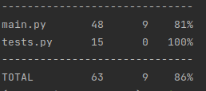

# CLI приложение для проверки строк на наличие ссылок

Установка зависимостей

    poetry install

Для запуска тестов введите в терминале pytest tests.py 

    coverage run -m pytest tests.py

для отображения покрытия coverage:
    
    coverage report

## Затраченное время на выполнение 4-4.5 часа

## Отчет о покрытии coverage

